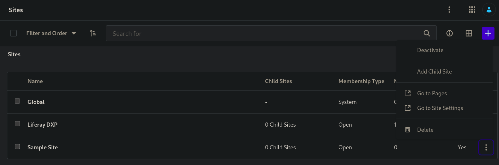
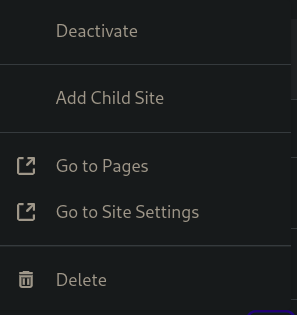

# Upgrade process training
That training had goal to develop java code that create web pages with Upgrade Process Framework. 

The module was created by API template using BLADE CLI, Java JDK 11 and MySQL Server.

The structure of the module is shown below:

  modules   
    |-- content-setup   
        |-- constants  
        |-- helper  
        |-- upgrade  
        ContentSetupUpgradeStepRegistrator.java

You need to start Liferay server, use lportal database and deploy content-setup module. If everything
is ok, the upgrade process will be executed successfully. 
You can check your schema version in lportal database in Release_ table. Also, you can check your site in Group_ table.
The site that was created, must be show up in localhost:8080 -> control panel -> Site, like this:

To see if the pages was created, you can click on three points on the right side and see "Go to page":

